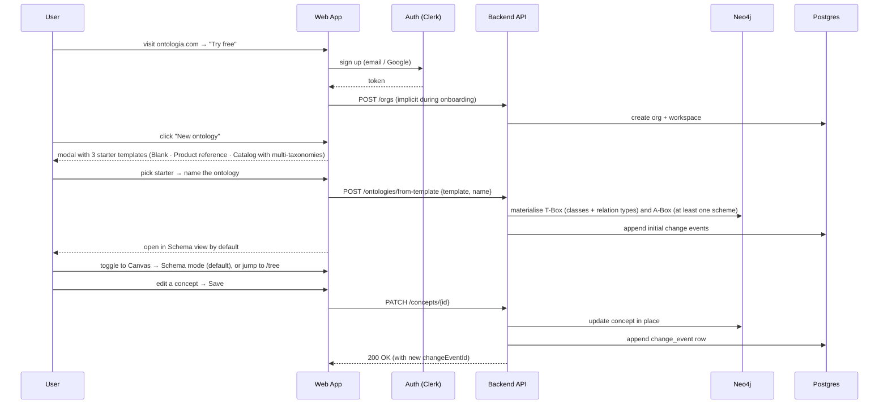

# User Flows

**Primary owner**: Valentin · **Contributor**: Alexandre · **Status**: Draft v5 (ontology-only product)

End-to-end flows for the MVP. Each flow has a happy path, key error states, and UX notes. Mermaid sequence diagrams are embedded where they add clarity.

> **MVP scope**: branches, review requests, threaded comments and three-way merges are deferred. The old "glossary quick-create" and "taxonomy import" flows are folded into the unified ontology flows below — neither exists as a separate path.

---

## 1. Sign-up to first ontology (activation flow)

**Objective.** A brand-new user lands on their first ontology and makes a meaningful change in under 10 minutes. There is only one entry point: **New ontology**.



**Starter templates in the modal.**
- **Blank** — empty T-Box, one default empty scheme. For architects who want to design from first principles.
- **Product reference** — small product / variant / category T-Box; a single catalogue scheme preloaded with a dozen sample concepts.
- **Catalog with multi-taxonomies** — the Cars-style shape. Nine classes (Manufacturer, Model, BodyStyle, Engine, Transmission, FuelType, DriveType, Segment, Country) with 13 relation types and five schemes (Model catalogue 2026, Body style taxonomy, Fuel type taxonomy, Market segments, Manufacturing geography) preloaded with real-world concepts — a great one-demo proof of the multi-taxonomy value proposition.

There is no "Glossary" or "Taxonomy" starter. Users who want a glossary pick Blank and add a single class and scheme; users who want a taxonomy pick Blank or Product reference and lean on the built-in `broader` relation. The product shape is the same.

**Key UX checkpoints.**
- Sign-up form: 1 step, no company questions.
- First workspace auto-named "Personal" (renameable).
- Post-template, the user lands on the Schema view so they immediately see the T-Box they just seeded.
- First-run tooltip ring guides them through Schema → Canvas → Tree → Tables.
- Empty-state CTAs remain available: "Import CSV" · "Start from template" · "Start blank".

**Edge cases.**
- SSO orgs: admin-led onboarding (see Flow 8).
- Free-tier limits reached (500 concepts or 5k API calls): soft-block with upgrade prompt.

---

## 2. Add a class (T-Box evolution)

**Objective.** A Data Architect adds a new class to an existing ontology without disturbing schemes already populated.

1. Architect opens the Schema view (or Canvas → Schema mode).
2. Clicks "Add class" → inline form asks for name, description, icon colour.
3. Submits → class appears in the list. Opens the class to reveal the attribute editor.
4. For each custom attribute: name, value type (string / number / boolean / enum / date / reference / money), required flag, localizable flag, enum values when applicable, description, hint. SKOS built-ins (prefLabel, altLabel, hiddenLabel, definition, notation, example) are always present and rendered read-only on the same panel.
5. (Optional) Adds relation types whose domain or range touches the new class — in the right-hand relation types panel.
6. A ChangeEvent of kind `create` lands in history.

**Safeguards.**
- Duplicate class names are rejected at save.
- Deleting a class is refused if any concept is still typed to it; the UI points at the blocking concepts.

---

## 3. Create a ConceptScheme (add a taxonomy)

**Objective.** A Maintainer creates a new scheme — e.g. adding a "Manufacturing geography" taxonomy next to an existing Model catalogue inside the same ontology.

1. User opens the Taxonomies tree view (`/tree`).
2. Clicks "+ New scheme" in the left rail → modal asks name, description, default language.
3. On submit, an empty scheme is created and selected. The user can now add concepts to it — they'll all be typed to classes from the ontology's shared T-Box.
4. A ChangeEvent records the creation.

**Notes.**
- Schemes share the parent ontology's T-Box; there's no per-scheme class editor. Evolving the T-Box happens in the Schema view and affects every scheme.
- The Canvas Taxonomies-mode scheme switcher and the Tables-view scheme tabs both pick up the new scheme automatically.

---

## 4. Add a concept

**Objective.** A Maintainer adds a concept to a scheme.

1. From the Taxonomies tree or Tables view, click "New concept".
2. Modal asks: target scheme, class (filtered to the T-Box), prefLabel per workspace language, optional notation.
3. On submit, the concept is created with status `active` and opened in the Concept detail view.
4. Maintainer fills in remaining SKOS slots (altLabels, hiddenLabels, definition, example) and any class-specific attributes; saves.
5. ChangeEvents record each change.

**Safeguards.**
- prefLabel uniqueness per scheme per language is enforced softly (duplicates flagged by the Validation panel, not blocked on save — so mass imports don't fail).
- If a required custom attribute is missing at save, inline validation blocks submit.

---

## 5. Edit a concept (direct change)

**Objective.** An Editor makes a small change to a concept.

```
Editor edits concept "Tesla Model 3" in Concept detail
  → UI stores the change in a local draft (green "unsaved" badge)
  → Editor clicks "Save"
  → PATCH /concepts/{id} with expectedLastEventId
  → Backend:
    - verifies expectedLastEventId still matches (else 409 stale-head)
    - updates the concept in Neo4j
    - appends a change_event to Postgres
  → History panel refreshes, presence chips clear, notifications fire for watchers
```

**Safeguards.**
- Conflict check: if another Editor saved first, the UI surfaces "this concept was just updated by @alex — reload or keep your version".
- Plan gating: if the org has hit the concept or API-call ceiling, Save returns 402 with a friendly upgrade prompt.

---

## 6. Reparent in the Taxonomies tree

**Objective.** A Maintainer moves a concept under a new parent (e.g. "Coupe" under "Performance") inside a hierarchical scheme.

1. Maintainer drags the row to its new parent in the tree view.
2. On drop, the product rewrites the `broader` relation (one delete of the old edge, one create of the new edge) in a single transaction.
3. A ChangeEvent of kind `update` lands in history with a reparent summary in the diff.

**Safeguards.**
- Drop is blocked if it would create a cycle; the tree shows a "cycle detected" toast and refuses the move.
- Dropping across schemes is disallowed in MVP (would imply a semantic move, not a hierarchy tweak).

---

## 7. Tag a good state

**Objective.** An Owner marks a known-good state of the ontology so downstream consumers can pin to it.

1. Owner opens history and finds the ChangeEvent they want to tag (usually "latest").
2. Clicks "Create tag" → modal asks for a name (e.g. `v1.2`, `2026-Q2`).
3. POST `/ontologies/{id}/tags` with `name` and `changeEventId`.
4. Tag appears in the history panel and in the Export modal's tag picker.
5. Downstream API consumers target `?tag=v1.2` on exports or list endpoints; format selected via `?format=json-ld|skos|turtle|owl|csv`.

**Notes.**
- Tag names are unique per ontology.
- Tags cannot be moved. To supersede a tag, append a new one.
- Tag-to-tag diff (v1.2 → v1.3) is available from the tag picker and shows added / modified / removed rollups.

---

## 8. Rollback / revert

**Objective.** A user restores the ontology to a prior state.

1. User opens history and selects a ChangeEvent.
2. Clicks "Revert this change".
3. Modal confirms: "This will append a new change event that undoes this one. History is preserved."
4. POST `/change-events/{id}/revert` with optional message.
5. Backend computes the inverse diff, applies it to Neo4j, appends a new change event.
6. History shows the revert with a link back to the original event.

**Multi-event revert.**
- Selecting a range ("revert everything since tag `v1.2`") generates one revert ChangeEvent per affected entity.
- Runs as an async job for large ranges; progress shown in-app.

**Notes.**
- Revert never deletes history; it adds to it.
- A revert can itself be reverted.

---

## 9. Deprecation with replacement

**Objective.** A Maintainer deprecates a concept that has been superseded.

1. Maintainer opens the concept (e.g. "Diesel") → Overview tab → "Deprecate".
2. Modal asks for deprecation reason and optional `dct:isReplacedBy` pointer to the replacement concept (e.g. "Diesel (EU6)").
3. On submit, the concept moves to `status=deprecated`; the replacement pointer is stored.
4. The Validation panel lights up every relation that still references the deprecated concept; Maintainer walks through them or schedules bulk actions.
5. Exports preserve the deprecation pointer so downstream consumers can remap.

---

## 10. Import → clean ontology

**Objective.** A user brings external content into their ontology — typically a CSV of concepts or a SKOS Turtle dump from a legacy system.

Supported import formats at MVP (all behind the same CSV wizard; SKOS / OWL / JSON-LD detection is format-first):
- **CSV** — the most common path; wizard maps columns to SKOS slots and custom attributes.
- **SKOS** (Turtle / RDF / XML) — materialises into one or more ConceptSchemes populated with concepts typed to a class the user picks.
- **Simplified OWL** — populates both layers: `owl:Class` → ConceptClass (T-Box), `owl:ObjectProperty` → RelationType with `rdfs:domain` / `rdfs:range`, `owl:NamedIndividual` → Concept in a chosen scheme.
- **JSON-LD** — round-trips both T-Box and A-Box via the published `@context`.

Flow:

1. "Import CSV" from the ontology menu.
2. **Upload** step: drag a file.
3. **Map columns** step: which column is prefLabel? description? parent (for `broader`)? altLabels (semicolon-delimited)? class — mandatory, picked from the T-Box.
4. **Target ontology + class** step: confirms where concepts will land (ontology already known from context; class selected in the previous step for CSV).
5. **Preview** step: shows 10 rows, highlights issues (duplicates, missing prefLabel, unmatched parents).
6. **Import** step: background job runs, produces one `bulk_import` ChangeEvent whose diff is the full list of creates.
7. User reviews the resulting state in the Tables or Tree view and can revert the import in one click if anything went wrong.

**Error handling.**
- Malformed file: stop early, show line numbers or path into the file.
- Duplicate prefLabels: offer "merge", "suffix", "fail".
- Partial failure: job completes with a summary; user can retry failed rows or revert the partial import.
- Cycles detected on `broader`: block and surface the cycle for the user to break.

---

## 11. Export (Export modal)

**Objective.** A user downloads an ontology for archiving, migration or downstream consumption.

1. User clicks "Export" in the ontology topbar.
2. Modal opens with:
   - **Format picker**: JSON-LD, SKOS Turtle, OWL RDF/XML, CSV.
   - **Scope selector**: full ontology (T-Box + every scheme) or a single ConceptScheme (A-Box only).
   - **Tag picker**: latest or any tagged snapshot.
   - **Live preview** on the right; updates when any selector changes.
3. User clicks "Download". For large ontologies, an async job produces a presigned URL.

Notes:
- Per-scheme SKOS export is the common taxonomy-migration path.
- Full-ontology OWL export is the architect path (Protégé / TopBraid interop).
- CSV export flattens per scheme and is intended for ad-hoc analysis; it does not round-trip.

---

## 12. API consumption (Platform Engineer)

**Objective.** A platform engineer ingests an ontology into a downstream system — RAG index, search index, data catalog, content pipeline.

1. Workspace settings → "Create API key"; engineer copies the bearer token. Fine-grained options: limit to `read:ontology`, `write:instance`, or full scope.
2. Engineer opens the **API Playground** (bell-icon-sibling button in the topbar, or ⌘K → "API Playground").
3. Picks an endpoint: `list-concepts`, `list-relations`, `schema`, `get-concept`, `SPARQL`.
4. Sets query params: `lang`, `tag`, `format`, `scheme` — the live JSON response updates as they tweak.
5. Copies the working call as cURL or fetch, pastes into their codebase.
6. Subscribes to webhooks (post-MVP): `POST /v1/webhooks {url, events:["change.created","tag.created"]}`. Events carry `entityType` across T-Box (`concept_class`, `relation_type`), A-Box containers (`scheme`), and A-Box instances (`concept`, `concept_relation`) — so a consumer can ignore schema churn and only re-index on instance changes.
7. Pipeline re-indexes incrementally; heavy consumers pull on `tag.created`.

**Common consumer patterns.**
- **RAG / AI copilot** — pulls the latest tag as JSON-LD, indexes SKOS definitions and altLabels, re-indexes on `tag.created`.
- **Data catalog / governance tool** — pulls as JSON or JSON-LD, maps Ontologia concepts to catalog terms.
- **Search / CMS / DAM** — pulls SKOS Turtle scoped to the relevant scheme, maps `prefLabel` / `altLabel` / `broader` to facet and autocomplete structures.
- **BI / analytics** — pulls CSV, joins against transactional tables.

Detailed auth, error codes and pagination in [API_SPECIFICATION.md](../02_architecture/API_SPECIFICATION.md).

---

## 13. Billing & plan change

**Objective.** An Owner upgrades from Team to Business.

1. Owner goes to `Org settings → Billing`.
2. Sees current plan, current-period usage (workspaces, concepts, API calls), next invoice.
3. Clicks "Upgrade to Business" → Stripe-hosted checkout.
4. On success, Stripe webhook updates the org → higher limits unlock in real time.
5. Usage is retroactively valid: no data loss.

**Downgrade path.**
- Downgrading below current usage blocks with a "resolve first" dialog (archive ontologies, reduce concepts).
- Enterprise plans use manual invoicing; Stripe is bypassed.

**Add-on attach.**
- Add-ons (extra concepts, extra API calls, AI pack) attached inline from the same Billing page.

---

## 14. SSO-based onboarding (Business / Enterprise)

**Objective.** An IT admin provisions the team via SAML or OIDC.

1. Admin configures SAML or OIDC in the Ontologia admin console.
2. (Business+) SCIM pushes users and groups; groups map to roles.
3. Users log in via IdP; memberships auto-assigned.
4. De-provisioning in IdP → membership removed within 5 minutes.

Full sequence in [AUTHENTICATION.md](../06_security_compliance/AUTHENTICATION.md).

---

## 15. Incident: service degradation

**Objective.** How users experience a partial outage.

- Read path degrades → read-only banner at the top of the app.
- Write path degrades → Save button disabled with a friendly message and a retry timer.
- Status page at `status.ontologia.com` auto-updates from monitoring signals.
- Webhooks retried on recovery.

Full engineering response playbook in [INCIDENT_RESPONSE.md](../05_operations/INCIDENT_RESPONSE.md).

---

## Deferred flows (ship with S1 / S2)

### D1. Change proposal with review (conceptual PR)

A contributor creates a branch, edits concepts, opens a review request, reviewers comment and approve, then merge. Full sequence diagram preserved in Git history of this file; will be re-enabled when branches ship.

### D2. Conflict resolution (3-way merge)

When two branches mutated the same concept, a reviewer resolves the conflict field-by-field (common ancestor · ours · theirs). Resolution commit lands on the feature branch; merge retries automatically.

These flows are fully designed but not built for MVP. The change-event log plus revert and tag-to-tag diff covers ~95% of the operational need until two paying customers request branches.

---

Related: [PRD](PRD.md) · [Personas](PERSONAS.md) · [Features](FEATURES.md) · [API Specification](../02_architecture/API_SPECIFICATION.md) · [Versioning System](../02_architecture/VERSIONING_SYSTEM.md)
