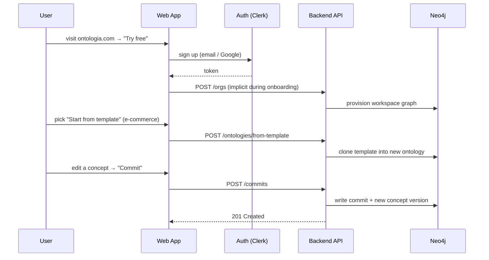
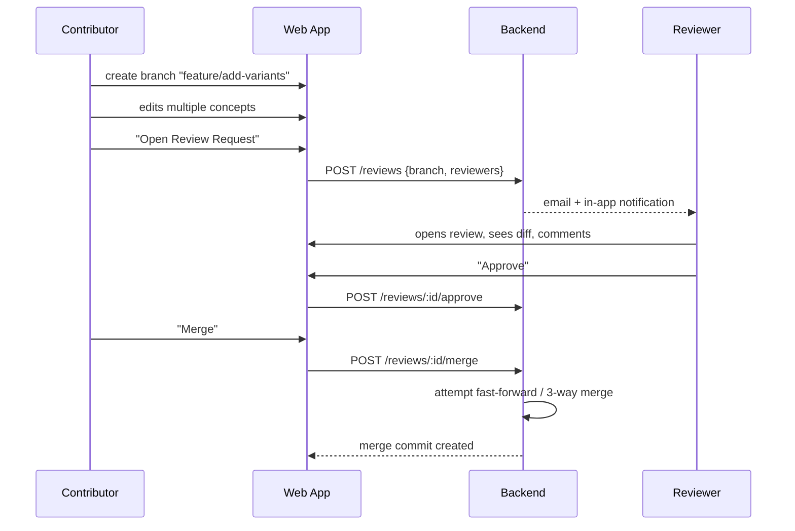

# User Flows

This document walks through the most important end-to-end flows. Each flow is described with the happy path, key error states and UX notes. Mermaid sequence diagrams are embedded where they add clarity.

---

## 1. Sign-up to first commit (activation flow)

**Objective.** A brand-new user lands on a first ontology and creates a meaningful commit in under 10 minutes.



**Key UX checkpoints.**
- Sign-up form: 1 step, no company questions.
- First workspace auto-named "Personal" (renameable).
- First-run tooltip ring: Canvas → Inspector → Commit button.
- Empty-state CTA: "Import CSV" · "Start from template" · "Start blank".

**Edge cases.**
- SSO orgs: admin-led onboarding (see Flow 5).
- Quota exceeded on Free tier: soft-block with upgrade prompt.

---

## 2. Direct commit on `main` (Editor on `main`)

**Objective.** A trusted Editor makes a small change directly on the default branch.

```
Editor edits concept "Product"
  → UI stores the change in a local draft (green "unsaved" badge)
  → Editor clicks "Commit changes"
  → Modal asks for a commit message
  → POST /commits {ontologyId, branchId=main, draftId}
  → Neo4j writes the new commit, advances HEAD of main
  → Changelog updates, webhooks fire, notifications go out
```

**Safeguards.**
- Branch policy can require review on `main` (disables direct commits) — enforced server-side.
- Conflict check runs before accepting the commit: if `main` advanced since the draft started, UI prompts "rebase" (replay on top of new HEAD) or "push to branch".

---

## 3. Change proposal with review (conceptual PR)

**Objective.** A contributor proposes changes that require sign-off before merging.



**UI highlights.**
- Review page layout: left rail (diff summary) · center (diff view, graph or list) · right rail (reviewers, status, comments).
- Concept-level threads; resolve on reply.
- Merge button disabled until approvals match policy.
- "Auto-archive branch on merge" default on.

---

## 4. Conflict resolution (3-way merge)

**Objective.** When two branches mutated the same concept, a reviewer resolves the conflict.

**Steps.**
1. Merge attempt detects conflict → UI surfaces "3 concepts need resolution".
2. Reviewer opens the conflict UI: three columns — common ancestor · ours (`main`) · theirs (`feature/foo`).
3. For each field (name, description, property, relation), reviewer picks a side or types a custom value.
4. Reviewer saves → backend creates a *resolution commit* on the feature branch.
5. Merge retried automatically.

**Error states.**
- Reviewer abandons: the partial resolution saves as draft.
- A third party pushes to `main` mid-resolution: UI warns and rebases the resolution context.

---

## 5. Rollback / revert

**Objective.** An admin restores a previous ontology state after a bad merge.

1. Admin opens history view, selects target commit `v2`.
2. Clicks "Revert to this version".
3. Modal confirms: "This will create a new commit that restores `v2`. History is preserved."
4. POST `/commits/revert`.
5. New commit `v4` sets all concepts/relations to the state at `v2`.
6. Changelog + webhooks reflect the revert.

**Notes.**
- Revert never deletes history.
- Revert across many merges is allowed but expensive; shown as an async job with progress.

---

## 6. CSV import → clean ontology

**Objective.** A domain expert brings a taxonomy from a spreadsheet.

1. "Import → CSV" with drag-drop.
2. Mapping step: which column is concept name? description? parent concept?
3. Preview: shows 10 rows, highlights issues (duplicates, unmatched parents).
4. Confirm → job runs (BullMQ) → import creates a draft on a new branch `import/YYYY-MM-DD`.
5. User reviews diff → commits → optionally opens a Review Request.

**Error handling.**
- Malformed CSV: stop early, show line numbers.
- Duplicate names: offer "merge", "suffix", "fail".
- Partial failure: job completes with a summary; user can retry failed rows.

---

## 7. API consumption (Platform Engineer)

**Objective.** Paul ingests the ontology into his RAG pipeline.

1. Workspace settings → "Create API key"; Paul copies the bearer token.
2. Paul calls `GET /v1/ontologies/:id/export?format=jsonld&ref=main`.
3. He subscribes to a webhook: `POST /v1/webhooks {url, events:["branch.merged"]}`.
4. On every merge, Ontologia POSTs a signed JSON payload to his endpoint.
5. Paul's pipeline re-indexes.

Detailed auth, error codes and pagination in [API_SPECIFICATION.md](../02_architecture/API_SPECIFICATION.md).

---

## 8. Billing & plan change

**Objective.** An Owner upgrades from Starter to Pro.

1. Owner goes to `Org settings → Billing`.
2. Sees current plan, usage, next invoice.
3. Clicks "Upgrade to Pro" → Stripe-hosted checkout.
4. On success, Stripe webhook updates the org → features unlock in real time.
5. Usage is retroactively valid: no data loss.

**Downgrade path.**
- Downgrading below current usage blocks with a "resolve first" dialog (archive ontologies, remove seats).
- Enterprise plans use manual invoicing; Stripe is bypassed.

---

## 9. SSO-based onboarding (Enterprise)

**Objective.** An IT admin provisions the whole team via SAML.

1. Admin configures SAML in the Ontologia enterprise console.
2. SCIM pushes users/groups; groups map to roles.
3. Users log in via IdP; seats auto-assigned.
4. De-provisioning in IdP → seat freed within 5 minutes.

Full sequence in [AUTHENTICATION.md](../06_security_compliance/AUTHENTICATION.md).

---

## 10. Incident: service degradation

**Objective.** How users experience a partial outage.

- Read path degrades → read-only banner at the top of the app.
- Write path degrades → Commit button disabled with a friendly message and a retry timer.
- Status page at `status.ontologia.com` auto-updates from monitoring signals.
- Webhooks retried on recovery.

Full engineering response playbook in [INCIDENT_RESPONSE.md](../05_operations/INCIDENT_RESPONSE.md).

---

Related: [PRD](PRD.md) · [Features](FEATURES.md) · [API Specification](../02_architecture/API_SPECIFICATION.md)
