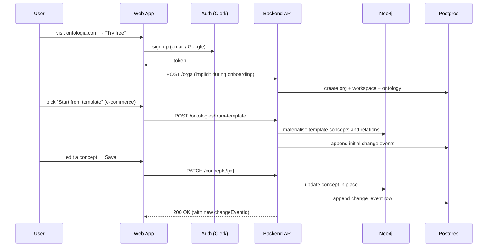

# User Flows

**Primary owner**: Valentin · **Contributor**: Alexandre · **Status**: Draft v2 (MVP scope trimmed)

End-to-end flows for the MVP. Each flow has a happy path, key error states, and UX notes. Mermaid sequence diagrams are embedded where they add clarity.

> **MVP scope**: branches, review requests, and three-way merges are deferred. Flows 3 and 4 in v1 of this doc (review request, conflict resolution) are moved to the deferred section at the end.

---

## 1. Sign-up to first change (activation flow)

**Objective.** A brand-new user lands on a first ontology and makes a meaningful change in under 10 minutes.



**Key UX checkpoints.**
- Sign-up form: 1 step, no company questions.
- First workspace auto-named "Personal" (renameable).
- First-run tooltip ring: Canvas → Inspector → Save button.
- Empty-state CTA: "Import CSV" · "Start from template" · "Start blank".

**Edge cases.**
- SSO orgs: admin-led onboarding (see Flow 6).
- Free-tier limits reached (500 concepts or 5k API calls): soft-block with upgrade prompt.

---

## 2. Edit a concept (direct change)

**Objective.** An Editor makes a small change to a concept.

```
Editor edits concept "Product"
  → UI stores the change in a local draft (green "unsaved" badge)
  → Editor clicks "Save"
  → PATCH /concepts/{id} with expectedLastEventId
  → Backend:
    - verifies expectedLastEventId still matches (else 409 stale-head)
    - updates the concept in Neo4j
    - appends a change_event to Postgres
  → Changelog updates, webhooks fire, notifications go out to watchers
```

**Safeguards.**
- Conflict check: if another Editor saved first, the UI surfaces "this concept was just updated by @alex — reload or keep your version".
- Plan gating: if the org has hit the concept or API-call ceiling, Save returns 402 with a friendly upgrade prompt.

---

## 3. Tag a good state

**Objective.** An Owner marks a known-good state of the ontology so downstream consumers can pin to it.

1. Owner opens history view and finds the change event they want to tag (usually "latest").
2. Clicks "Create tag" → modal asks for a name (e.g. `v1.2`, `2026-Q2`).
3. POST `/ontologies/{id}/tags` with `name` and `changeEventId`.
4. Tag appears in the history view and is available via the API (`GET /tags`).
5. Downstream API consumers target `?tag=v1.2` in their export calls.

**Notes.**
- Tag names are unique per ontology.
- Tags cannot be moved. To supersede a tag, append a new one.
- Tags are surfaced in exports as a `tag:` field so consumers can tell which named version they received.

---

## 4. Rollback / revert

**Objective.** A user restores the ontology to a prior state.

1. User opens history view and selects a change event.
2. Clicks "Revert this change".
3. Modal confirms: "This will append a new change event that undoes this one. History is preserved."
4. POST `/change-events/{id}/revert` with optional message.
5. Backend computes the inverse diff, applies it to Neo4j, appends a new change event.
6. Changelog shows the revert with a link back to the original event.

**Multi-event revert.**
- Selecting a range ("revert everything since tag `v1.2`") generates one revert change event per affected entity.
- Runs as an async job for large ranges; progress shown in-app.

**Notes.**
- Revert never deletes history; it adds to it.
- A revert can itself be reverted.

---

## 5. CSV import → clean ontology

**Objective.** A domain expert brings a taxonomy from a spreadsheet.

1. "Import → CSV" with drag-drop.
2. Mapping step: which column is concept name? description? parent concept?
3. Preview: shows 10 rows, highlights issues (duplicates, unmatched parents).
4. Confirm → job runs (BullMQ) → import appends a single `operation='bulk_import'` change event whose diff is the full list of creates.
5. User reviews the resulting state on the canvas and can revert the import in one click if anything went wrong.

**Error handling.**
- Malformed CSV: stop early, show line numbers.
- Duplicate names: offer "merge", "suffix", "fail".
- Partial failure: job completes with a summary; user can retry failed rows or revert the partial import.

---

## 6. API consumption (Platform Engineer)

**Objective.** A platform engineer ingests the ontology into their RAG pipeline.

1. Workspace settings → "Create API key"; engineer copies the bearer token.
2. Engineer calls `GET /v1/ontologies/:id/exports?format=jsonld` (async job returns presigned URL).
3. Engineer subscribes to a webhook: `POST /v1/webhooks {url, events:["change.created","tag.created"]}`.
4. On every change, Ontologia POSTs a signed JSON payload to their endpoint.
5. Pipeline re-indexes incrementally; for heavy consumers, they pull when a new tag is created.

Detailed auth, error codes and pagination in [API_SPECIFICATION.md](../02_architecture/API_SPECIFICATION.md).

---

## 7. Billing & plan change

**Objective.** An Owner upgrades from Team to Business.

1. Owner goes to `Org settings → Billing`.
2. Sees current plan, current-period usage (workspaces, concepts, API calls), next invoice.
3. Clicks "Upgrade to Business" → Stripe-hosted checkout.
4. On success, Stripe webhook updates the org → higher limits unlock in real time.
5. Usage is retroactively valid: no data loss.

**Downgrade path.**
- Downgrading below current usage blocks with a "resolve first" dialog (archive workspaces, reduce concepts).
- Enterprise plans use manual invoicing; Stripe is bypassed.

**Add-on attach.**
- Add-ons (extra concepts, extra API calls, AI pack) attached inline from the same Billing page.

---

## 8. SSO-based onboarding (Business / Enterprise)

**Objective.** An IT admin provisions the team via SAML or OIDC.

1. Admin configures SAML or OIDC in the Ontologia admin console.
2. (Business+) SCIM pushes users and groups; groups map to roles.
3. Users log in via IdP; memberships auto-assigned.
4. De-provisioning in IdP → membership removed within 5 minutes.

Full sequence in [AUTHENTICATION.md](../06_security_compliance/AUTHENTICATION.md).

---

## 9. Incident: service degradation

**Objective.** How users experience a partial outage.

- Read path degrades → read-only banner at the top of the app.
- Write path degrades → Save button disabled with a friendly message and a retry timer.
- Status page at `status.ontologia.com` auto-updates from monitoring signals.
- Webhooks retried on recovery.

Full engineering response playbook in [INCIDENT_RESPONSE.md](../05_operations/INCIDENT_RESPONSE.md).

---

## Deferred flows (ship with S1 / S2)

### D1. Change proposal with review (conceptual PR)

A contributor creates a branch, edits concepts, opens a review request, reviewers comment and approve, then merge. Full sequence diagram preserved in Git history of this file; will be re-enabled when branches ship.

### D2. Conflict resolution (3-way merge)

When two branches mutated the same concept, a reviewer resolves the conflict field-by-field (common ancestor · ours · theirs). Resolution commit lands on the feature branch; merge retries automatically.

These flows are fully designed but not built for MVP. The change-event log plus revert covers ~95% of the operational need until two paying customers request branches.

---

Related: [PRD](PRD.md) · [Features](FEATURES.md) · [API Specification](../02_architecture/API_SPECIFICATION.md) · [Versioning System](../02_architecture/VERSIONING_SYSTEM.md)
