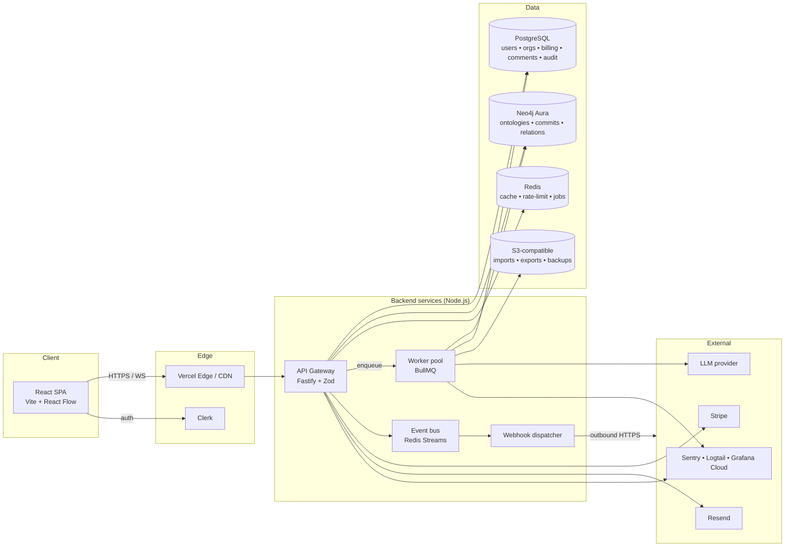

# System Architecture

**Primary owner**: Alexandre · **Contributor**: Valentin · **Status**: Draft v2 (MVP scope trimmed)

High-level architecture for Ontologia. This document is the starting point for engineers; it links to deeper documents for each subsystem.

> **MVP scope**: the branch / commit / review layer is deferred (see [VERSIONING_SYSTEM.md](VERSIONING_SYSTEM.md)). MVP persists ontologies as current state in Neo4j plus an append-only change-event log in Postgres.

---

## 1. Guiding principles

1. **Separate what's relational from what's a graph.** Accounts, billing, sessions, comments live in Postgres; ontologies (concepts, relations, versions) live in Neo4j.
2. **Multi-tenant by construction.** Every query, cache key, job, log line, metric is scoped by `orgId`.
3. **Stateless web tier.** All state is in databases, caches, queues or object storage.
4. **Boring by default.** Well-understood components; reach for novelty only where the product advantage justifies it (versioning, diff).
5. **Observability is not optional.** Logs, metrics, traces, audit events on every request.

---

## 2. Logical view

---

## 3. Components

### 3.1 Frontend

- **React 18 + TypeScript + Vite.**
- **State:** TanStack Query for server state; Zustand for client-only UI state.
- **Graph canvas:** React Flow for the main canvas; d3-hierarchy for the tree view.
- **Routing:** React Router.
- **Auth:** Clerk React SDK.
- **Styling:** Tailwind CSS + Radix UI primitives; design tokens in [`DESIGN_SYSTEM.md`](../04_design/DESIGN_SYSTEM.md).
- **Build & deploy:** Vercel, previews per PR, production deploys from `main`.
- **Observability:** Sentry browser SDK, Vercel analytics.

### 3.2 API Gateway (Node.js)

- **Runtime:** Node 20 LTS.
- **Framework:** Fastify. Reasoning: low overhead, great schema integration via JSON schema / Zod, plugin ecosystem.
- **Validation:** Zod at the edge; schemas auto-derive the OpenAPI spec.
- **Auth:** Clerk-issued JWT verified on every request; API keys verified via Postgres + hashed table.
- **Authorisation:** CASL-style policy module (role + resource → decision).
- **Errors:** Problem-details JSON (RFC 7807).
- **Tracing:** OpenTelemetry, spans per handler and per DB call.

### 3.3 Worker pool

- Same Node image as the API; different entrypoint.
- **Queue:** BullMQ on Redis. Queues: `import`, `export`, `merge`, `llm-suggestions`, `webhook-delivery`.
- **Idempotency:** every job keyed; retries are idempotent.
- **Concurrency:** configurable per queue; autoscaled on Render/Fly.io.

### 3.4 Event bus & webhooks

- **Internal bus:** Redis Streams. Producers are API handlers; consumers are the webhook dispatcher, audit indexer and notification service.
- **Webhook dispatcher:** BullMQ worker. Signs payloads with per-subscription HMAC secret, exponential backoff, DLQ after 24 h.

### 3.5 Databases

**Postgres 16 (managed — Neon for MVP).**
Entities (MVP): `organizations`, `workspaces`, `memberships`, `users`, `api_keys`, `change_event`, `tag`, `comments`, `notifications`, `audit_events`, `subscriptions`, `usage_counters`, `invoices`, `webhook_subscriptions`. `reviews` and `review_reviewers` ship with S2.

**Neo4j Aura 5.x (Free tier at build, Professional from launch).**
Entities (MVP): `:Org`, `:Ontology`, `:Concept`, `:ConceptRelation`, `:RelationType`, `:Tag`. The `:Branch`, `:Commit` and commit-graph edges ship with S1. See [DATA_MODEL.md](DATA_MODEL.md).

**Redis 7.**
Uses: cache (hot ontology heads, rate limits), BullMQ queues, Redis Streams event bus, WebSocket pub/sub for in-app notifications.

**S3-compatible object storage (Cloudflare R2 initially).**
Uses: import payloads, export artefacts, backups, large attachments.

### 3.6 External services

| Purpose | Vendor | Notes |
|---|---|---|
| Auth | Clerk | Email, Google, Microsoft, OIDC on Team+, SAML on Business+ |
| Payments | Stripe | Tax via Stripe Tax; self-serve + manual invoicing |
| Email | Resend | Transactional; Postmark as backup |
| LLM | OpenAI primary, Anthropic fallback | Route via internal abstraction; per-workspace usage cap |
| Error tracking | Sentry | FE + BE |
| Logs | Logtail | JSON structured |
| Metrics & dashboards | Grafana Cloud | Prometheus-compatible metrics, Loki for logs pipeline, Tempo for traces |

---

## 4. Multi-tenant strategy

Summary — full detail in [MULTI_TENANCY.md](MULTI_TENANCY.md):

- **Enterprise:** one Neo4j Aura database per organisation ("database-per-tenant").
- **Free, Team, Business:** shared Neo4j database with `orgId` property on every node and edge, indexed, enforced via Cypher middleware. Business customers can upgrade to dedicated Aura on request.
- Postgres is always shared; `orgId` is on every row and enforced by row-level security (RLS).
- Redis keys are always prefixed with `org:{orgId}:`.

---

## 5. Request paths (happy path examples — MVP)

### 5.1 Edit a concept (append a change event)
1. `PATCH /v1/concepts/:id` with new field values and `expectedLastEventId`.
2. Fastify handler validates with Zod, checks authz (`write:ontology`), verifies plan limits (`usage_counters`).
3. Two-phase write coordinated by the app layer:
   a. Append a row to `change_event` in Postgres.
   b. Update the `:Concept` node in Neo4j, setting `lastChangeEventId`.
4. Postgres insert into `audit_events`.
5. Event emitted on Redis Streams (`change.created`).
6. Response within 150 ms on p50.
7. Webhook dispatcher and notification service consume the event asynchronously.

### 5.2 Revert a change event
1. `POST /v1/change-events/:id/revert`.
2. Backend loads the target event's diff and computes the inverse.
3. Append a new `change_event` row with `operation='revert'` and apply the inverse to Neo4j in the same two-phase write.
4. Event emitted on Redis Streams (`change.reverted`).

### 5.3 Diff two change events
1. `GET /v1/ontologies/:id/diff?from=eventA&to=eventB`.
2. Check cache key `diff:{orgId}:{ontologyId}:{from}:{to}`.
3. On miss, replay relevant change events from Postgres and compute the set diff at concept/relation level.
4. Cached 1 h; invalidated on any new change event on that ontology.

### 5.4 Bulk import
1. `POST /v1/ontologies/:id/imports` with an uploaded file.
2. File stored in R2; an `import` job is enqueued.
3. Worker processes the file, validates entries, and appends a single `operation='bulk_import'` change event whose diff contains the list of creates.
4. Neo4j state updated in the same worker transaction.

### 5.5 Deferred — merge branch (ships with S1)
1. `POST /v1/branches/:id/merge`.
2. Attempt fast-forward in a single transaction.
3. On divergence, enqueue a `merge` job that computes the 3-way merge (common ancestor, ours, theirs).
4. If conflicts, job returns a conflict report; UI shows resolution flow.
5. On resolution, a new commit is created and the branch HEAD advances.

---

## 6. Scalability plan

| Concern | MVP | Growth trigger | Mitigation |
|---|---|---|---|
| Neo4j per-tenant count | Shared tenant for Team and Business | > 3 Enterprise tenants | Add dedicated Aura clusters per Enterprise customer |
| Single-graph canvas size | Up to 5k nodes | > 20k nodes in workspace | Server-side culling; "focus area" mode |
| Change-event throughput | ~100 writes / s on shared Postgres | Sustained > 500 writes / s | Partition `change_event` by `org_id` hash |
| Search index size | Postgres `tsvector` | > 50M tokens cluster-wide | OpenSearch migration (pre-planned) |
| WebSocket connections | Single Redis pub/sub | > 10k concurrent | Redis Cluster + shard by workspace |
| Job throughput | 2 workers × 2 concurrency | Queue latency > 1 min | Autoscale workers, priority queues |

---

## 7. Availability targets

Detailed SLA in [SLA.md](../05_operations/SLA.md).

- Free / Starter: 99.5% monthly.
- Pro: 99.9% monthly.
- Enterprise: 99.95% monthly, with credits.

Error budgets govern release velocity; see [RELEASE_PROCESS.md](../05_operations/RELEASE_PROCESS.md).

---

## 8. Security posture

See [SECURITY.md](../06_security_compliance/SECURITY.md). Highlights:

- TLS 1.3 everywhere; HSTS; strict CSP.
- Secrets in AWS Secrets Manager (or 1Password Connect), never in repo.
- Network perimeter: Cloudflare WAF + per-endpoint rate limits.
- Data at rest: AES-256 by cloud provider; PII minimisation in Postgres.
- Audit log for every privileged operation.

---

## 9. Related

- [Tech Stack](TECH_STACK.md)
- [Data Model](DATA_MODEL.md)
- [Versioning System](VERSIONING_SYSTEM.md)
- [Multi-Tenancy](MULTI_TENANCY.md)
- [API Specification](API_SPECIFICATION.md)
- [Integrations](INTEGRATIONS.md)
- [Infrastructure](../05_operations/INFRASTRUCTURE.md)
