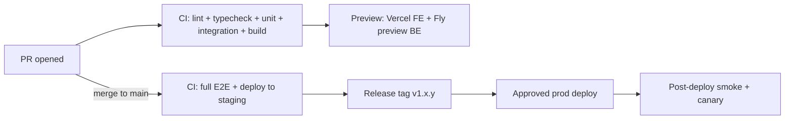

# Deployment

How code moves from a PR to production.

---

## 1. Environments recap

| Env | Source | Trigger | Audience |
|---|---|---|---|
| Preview | PR branch | open/update PR | PR reviewers |
| Staging | `main` | merge to `main` | internal, design partners |
| Prod | `main` | manually promoted tag | everyone |

## 2. Pipeline overview

## 3. CI checks (every PR)

- Install deps.
- Lint (`eslint`), format check (`prettier`), typecheck (`tsc -b`).
- Unit tests (vitest).
- Integration tests against Testcontainers (Postgres + Neo4j + Redis).
- Build bundles; enforce size budgets.
- Storybook build + a11y checks for touched components.
- Security: `semgrep`, `pnpm audit --prod`, `gitleaks`.
- Coverage report uploaded.

Total wall-clock target: **≤ 8 minutes p95**.

## 4. Preview deploys

- Vercel provisions a preview URL per PR.
- Fly.io creates a preview app for the backend; migrations run against a disposable Postgres branch.
- URL posted back into the PR as a sticky comment.
- Preview env talks to test Clerk, Stripe test mode, Resend sandbox.

## 5. Merge to `main` → staging

On merge:

1. Migrations job runs against staging Postgres and staging Neo4j.
2. API image built + deployed to Fly.io (blue/green).
3. Frontend promoted on Vercel.
4. Post-deploy job: smoke tests (Playwright mini-suite).
5. Notifications: `#deploys` in Slack, green/red with a diff link.

## 6. Production release

### 6.1 Cut a release

- Release lead (on rotation) chooses a SHA on `main` that passed staging.
- Creates a signed tag `vX.Y.Z`.
- GitHub Actions composes release notes from Conventional Commits since the last tag.
- Release lead edits notes for humans, publishes.

### 6.2 Deploy

- Approval workflow gated by CODEOWNERS.
- Migrations run in a pre-deploy step.
- Backend deploys blue/green with a **canary** (10% traffic) for 10 minutes; error rate > threshold auto-rolls back.
- Frontend promoted on Vercel.
- Post-deploy smoke suite runs.
- Sentry release tagged; source maps uploaded.
- Team posts "shipped" in `#deploys`.

### 6.3 Cadence

- Weekly release during Phases 1–3.
- Fortnightly on the `release/*` track for Enterprise customers on pinned releases.
- Hotfixes same-day.

## 7. Migrations

- Run pre-deploy from a one-shot job.
- Migrations are online-safe (see [DATABASE_MIGRATIONS.md](../03_engineering/DATABASE_MIGRATIONS.md)).
- Deploy rolls forward; if a migration fails, the deploy fails and we investigate.

## 8. Feature flags

- PostHog feature flags service.
- Default OFF for new features.
- Ramp-up: internal → 1% → 5% → 25% → 100% with observation windows.
- Flag removal target noted in the PR description.

## 9. Rollback

- **Frontend.** Promote a previous Vercel deployment — ~30 s.
- **Backend.** Route 100% to the blue slot — ~60 s.
- **Migrations.** Forward-only; roll back code if behaviour regressed; data-level rollback is a separate, deliberate action with backups.
- Document the rollback in `#incidents` and the retro.

## 10. Rollout of breaking API changes

- Announce via `Sunset` / `Deprecation` headers + email + changelog.
- 12-month deprecation window for public API.
- Support both during the window.
- Client SDKs ship a new major on the same day.

## 11. Access & permissions

- Only CODEOWNERS + CTO can approve prod deploys.
- Infra changes gated through the `infra` approval group.
- Audit log of deploys kept for 12 months.

## 12. Post-deploy verification

Checklist run automatically + manually:

- `/healthz` green on all regions.
- `/ready` green.
- Synthetic checks green.
- Sentry error rate < baseline + 10% for 15 min.
- p95 latency < baseline + 20%.
- Webhook delivery success rate > 99%.

## 13. Emergencies

See [INCIDENT_RESPONSE.md](INCIDENT_RESPONSE.md) for the full playbook.

Related: [CI/CD](CI_CD.md) · [Release Process](RELEASE_PROCESS.md) · [Infrastructure](INFRASTRUCTURE.md) · [Database Migrations](../03_engineering/DATABASE_MIGRATIONS.md)
