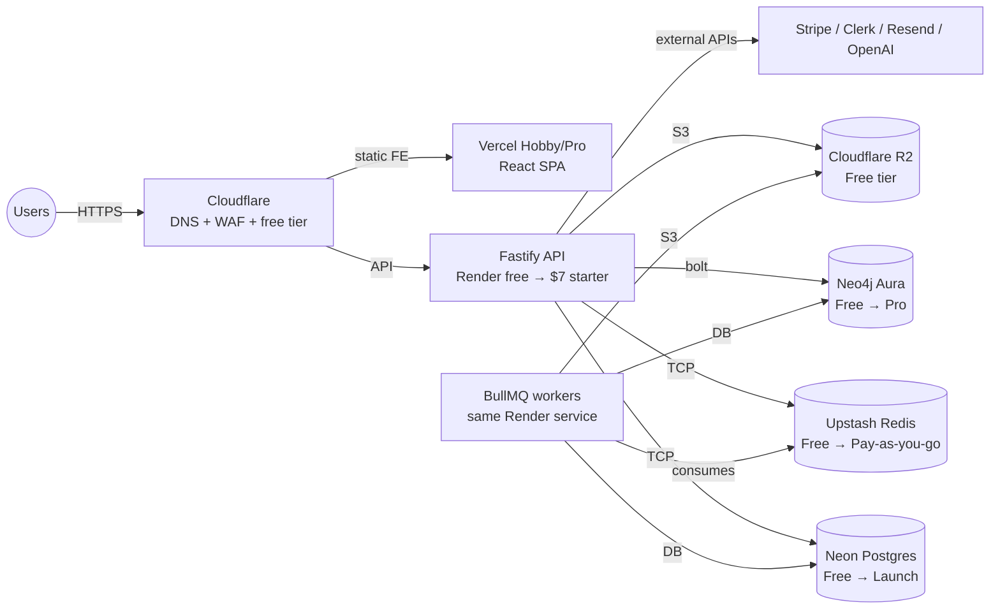

# Infrastructure

**Primary owner**: Alexandre · **Contributor**: Valentin · **Status**: Draft v2 (bootstrap-aligned)

Semlify's infrastructure is declared as code from day one. This document describes what runs where, how we provision and change it, and how we scale from "two founders on a laptop" to "a real mid-market SaaS" without blowing up the cash chart.

> **Bootstrap posture.** Phase 0 runs on free tiers only (~$25 / month all-in). Paid tiers unlock as customers do. Every vendor choice below has an "exit hatch" — we will not pick a service that locks us in before we can swap.

---

## 1. Environments

| Environment | Purpose | URL | Data | When we add it |
|---|---|---|---|---|
| `dev` | Each founder's laptop | `localhost` | Disposable | Day 1 |
| `preview` | Per-PR ephemeral deploy (FE only in Y1) | `*.preview.semlify.com` | Synthetic | Phase 0 |
| `staging` | Pre-prod, always live | `staging.semlify.com` | Sanitised clone of prod (weekly refresh) | Phase 2 (paid launch) |
| `prod` | Production | `app.semlify.com` / `api.semlify.com` | Real | Phase 2 |
| `sandbox` | Customer playground | `sandbox.semlify.com` | Customer test tenants | Phase 3+ (on demand) |

Staging and prod share the same IaC modules with different parameters. In Phase 0 and Phase 1, staging is a branch deploy on the same Render / Neon / Upstash / Neo4j Aura free-tier instance as prod will be — we promote, we don't duplicate.

## 2. High-level diagram (MVP)



In Phase 0–1 the API and workers run in a single Render service on the free plan. We split them once the queue justifies it (Phase 2 onward).

## 3. Vendors & accounts

Every vendor is justified in [COST_ANALYSIS.md](../08_finance/COST_ANALYSIS.md). Account ownership across two founders is pragmatic — most technical vendors sit on Alexandre's login; billing-oriented ones on Valentin's.

| Service | Vendor | Account owner | Phase 0 tier | Phase 3 tier | Exit plan |
|---|---|---|---|---|---|
| DNS / CDN / WAF | Cloudflare | Alexandre | Free | Free | Any DNS provider; WAF swap is two days of work |
| FE hosting | Vercel | Alexandre | Hobby (free) | Pro ($20/mo) | Netlify, Cloudflare Pages — trivial swap |
| BE + worker hosting | Render | Alexandre | Free | Starter ($7/mo/service) → Standard when needed | Fly.io, Railway — Docker image is portable |
| Postgres | Neon | Alexandre | Free (0.5 GB) | Launch ($19/mo) → Scale when data > 10 GB | Supabase, RDS — standard Postgres dump |
| Graph DB | Neo4j Aura | Alexandre | Free (200k nodes) | Pro (from $65/mo) → Enterprise dedicated | Neo4j self-hosted container — Cypher is portable |
| Redis | Upstash | Alexandre | Free (10k commands/day) | Pay-as-you-go | Railway Redis, AWS ElastiCache |
| Object storage | Cloudflare R2 | Alexandre | Free (10 GB) | Pay-as-you-go | AWS S3 — R2 is S3-compatible |
| Auth | Clerk | Alexandre | Free (10k MAU) | Pro ($25/mo + usage) | Auth.js self-hosted, WorkOS for enterprise — multi-week swap |
| Billing | Stripe | Valentin | — (revenue share) | Standard + Stripe Tax | No credible swap at our size |
| Email (transactional) | Resend | Alexandre | Free (3k/mo) | Pro ($20/mo) | Postmark, SES — API-similar |
| Error tracking | Sentry | Alexandre | Free (5k errors/mo) | Team ($26/mo) | Rollbar, Bugsnag |
| Logs | Logtail (BetterStack) | Alexandre | Free (1 GB) | Pro ($24/mo) | Datadog, Axiom |
| Metrics | Grafana Cloud | Alexandre | Free | Pro ($29/mo) when we outgrow free | Self-hosted Prometheus |
| Secrets | Doppler | Alexandre | Developer (free) | Team when we hire | AWS Secrets Manager |
| Repo + CI | GitHub Actions | Alexandre | Free (2k min / mo private) | Team plan when we have > 2 devs | GitLab, BitBucket |
| Uptime | Better Uptime (BetterStack) | Alexandre | Free (10 monitors) | Pro ($29/mo) | UptimeRobot |
| Status page | Better Stack Status | Alexandre | Free (10 components) | Small ($19/mo) | Instatus |

> **Rule**: no vendor is added without a written reason and an exit plan. "It's nice" is not a reason.

## 4. Regions

- **Phase 0–2 prod**: `us-east-1` only (Neon, Render, Upstash, Neo4j Aura). Cheapest, most service availability, closest to most North American buyers.
- **Phase 3 prod**: add `eu-west-1` when either (a) a Business-tier EU customer requires it contractually, or (b) EU signups exceed 25% of MAU.
- **Neo4j Aura**: shared DB co-located with Postgres; regional per-tenant only for Enterprise.
- **CDN**: global via Cloudflare from day one.

## 5. Terraform layout

Infrastructure-as-code from the first production deploy. In Phase 0 we accept a small amount of click-ops (Clerk and Stripe dashboards), but every cloud resource is in Terraform by Phase 2.

```
infra/terraform/
├── modules/
│   ├── core/             # DNS, Cloudflare WAF, R2 buckets
│   ├── api/              # Render service(s)
│   ├── postgres/         # Neon project + branches
│   ├── redis/            # Upstash DB
│   ├── neo4j/            # Aura config (stub — mostly dashboard-driven)
│   ├── stripe/           # Stripe products + prices
│   └── observability/    # Sentry, Logtail, Grafana wiring
└── envs/
    ├── staging/
    └── prod/
```

- State stored in a locked S3-compatible R2 bucket with a lightweight `dynamodb`-equivalent via Cloudflare D1 (or Terraform Cloud's free tier, which is easier in Y1).
- CI applies staging on merge to `main`; prod via a manually-approved GitHub Environment with both founders listed as reviewers.

## 6. Secrets management

- Secrets defined in Doppler from day one. Never in `.env` checked into the repo. Never in Terraform state.
- App reads from environment on boot.
- Long-lived API keys rotated quarterly; on-demand on suspicion of compromise.
- Stripe, Clerk, OpenAI, Resend, Neon, Neo4j, Upstash credentials all flow through Doppler.

## 7. Boot sequence

- API starts → loads config → connects to Postgres / Neo4j / Redis → registers routes → OTel initialised → listens.
- Workers share the same process in Phase 0–1 (BullMQ runs in-process); split into a dedicated Render service from Phase 2.
- Readiness probes: `/healthz` (liveness) and `/ready` (dependencies OK).
- Graceful shutdown on SIGTERM, up to 30 seconds drain.

## 8. Autoscaling

### Phase 0–1
- API: 1 instance, 512 MB RAM. No autoscaling needed — we have fewer than 100 MAU.
- Workers: in-process; queue depth typically < 10.

### Phase 2 (paid launch)
- API: min 1, max 3. CPU-based autoscaling with request latency as the authoritative metric.
- Workers: min 1, max 2 per queue.

### Phase 3–4
- API: min 2, max 10 per region.
- Workers: min 1, max 5 per queue.

Always set scale-down delays to avoid flapping during deploys.

## 9. Network perimeter

- All public traffic through Cloudflare (DNS + WAF on the free tier).
- WAF: standard managed rules for common exploits; geo-restrictions available on Enterprise contracts.
- Rate limits at Cloudflare (coarse) + app (fine-grained, per API key and per org).
- Internal traffic: Render private networking once we split services.
- No inbound DB access from the internet — ever. Always via API or workers.

## 10. Deployment model

- **Frontend**: Vercel preview per PR; prod deploy from `main`.
- **Backend**: Render rolling deploys triggered by CI on `main`. Blue/green is a Phase 3 concern.
- **Migrations**: run as a pre-deploy job. See [DATABASE_MIGRATIONS.md](../03_engineering/DATABASE_MIGRATIONS.md) and [CI_CD.md](CI_CD.md).

Detail in [DEPLOYMENT.md](DEPLOYMENT.md).

## 11. Observability infra

- **Logs**: `pino` → stdout → Render logs → Logtail (Phase 2 onward; Phase 0–1 = Render log viewer is fine).
- **Metrics**: OpenTelemetry exporter → Grafana Cloud Prometheus (Phase 2 onward).
- **Traces**: OTLP → Grafana Tempo (Phase 3 onward; Phase 0–1 we rely on server-timing headers and Sentry performance).
- **Errors**: Sentry (FE + BE) from day one.
- **Uptime**: Better Uptime synthetic checks on `/healthz`, `/ready`, and the sign-up flow from Phase 1.
- **Status page**: Better Stack Status from Phase 2, with auto-incidents wired to uptime alerts.

Detail in [MONITORING.md](MONITORING.md).

## 12. Disaster recovery infra

- Postgres PITR: Neon Free includes 24 hours; Launch extends to 7 days; Scale to 30 days. Enterprise contractual commitment: 90 days (requires the Neon Business tier, priced in when we sign the first Enterprise).
- Neo4j Aura: daily snapshots standard; manual on-demand before destructive migrations.
- R2: versioning on; 30-day retention of non-current versions.
- Backups tested quarterly by restoring into a disposable environment and running a checksum script on a known ontology.

Detail in [BACKUP_DR.md](BACKUP_DR.md).

## 13. Cost controls

- Render: avoid "always-on" staging when no one is using it — cron-schedule scale-to-zero overnight in Year 1.
- Neo4j Aura: right-sized per tenant; dormant Enterprise tenants scaled down after 14 days (only relevant once we have Enterprise customers).
- Upstash: pay-per-command pricing aligns naturally with usage.
- **LLM usage** (AI pack customers only): per-workspace monthly cap + global daily cap enforced in the API layer. Full cost model in [COST_ANALYSIS.md](../08_finance/COST_ANALYSIS.md).
- Weekly infra bill review during Monday founder standup. A single unexplained bump > $25 / month gets investigated immediately.

## 14. Change management

- All infra changes via PR.
- `infra/terraform/envs/prod` requires approval from the non-author founder (CODEOWNER in Phase 0–1 = both founders on everything).
- Tagged `infra-change` in the release notes.
- High-impact changes (DB version upgrade, region add, provider swap) need a short written ADR in `docs/03_engineering/ADRs/`.

## 15. Bootstrap infra cost checkpoints

Quick sanity check against the [COST_ANALYSIS.md](../08_finance/COST_ANALYSIS.md) projections:

| Phase | MAU / customers | Monthly infra cost target |
|---|---|---|
| Phase 0 — Foundations | Founders + design partners | ~$25 / month |
| Phase 2 — Paid launch | 5–10 paying customers | ~$150–$275 / month |
| Phase 3 — GA ramp | 15–25 paying customers | ~$500–$800 / month |
| Phase 4 — Early scale | 50 paying customers | ~$1,800 / month |

If a phase's infra cost is tracking > 1.5× the target for two consecutive months without a corresponding revenue bump, both founders review the bill line-by-line before adding anything new.

Related: [Deployment](DEPLOYMENT.md) · [CI/CD](CI_CD.md) · [Monitoring](MONITORING.md) · [Backup & DR](BACKUP_DR.md) · [Cost Analysis](../08_finance/COST_ANALYSIS.md) · [Architecture](../02_architecture/ARCHITECTURE.md)
